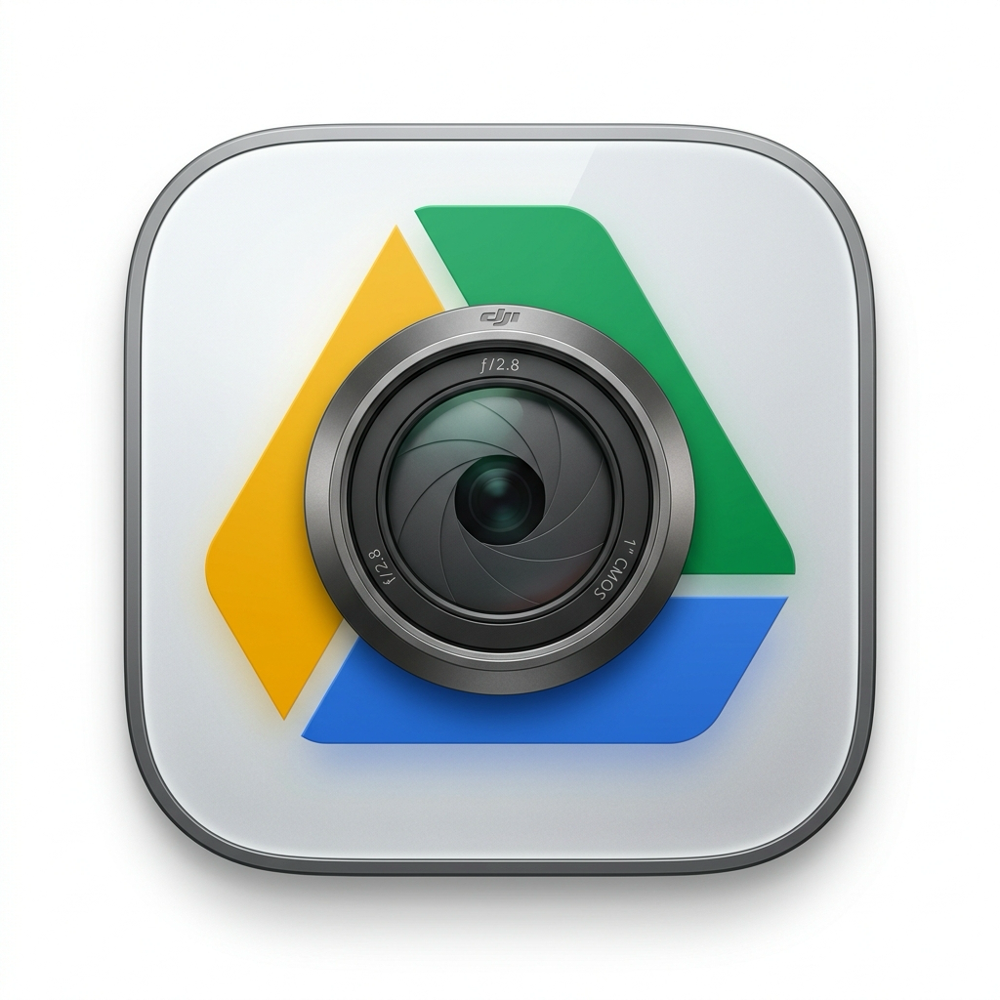

# 🛸 DJIToGoogleDrive (DJI to Google Drive Sync Hub)

<p align="center">
  
</p>

<p align="center">
  <b>Native macOS Automated Cloud Synchronization Hub for DJI Creators & Filming Workflows</b><br>
  Designed for <b>Osmo Pocket 3 / 4</b>, <b>DJI 360 Action Cameras</b>, <b>Action Series</b>, and High-Speed TF / SD Cards
</p>

<p align="center">
  <a href="README.md"><b>English</b></a> •
  <a href="README_zh.md"><b>简体中文</b></a>
</p>

<p align="center">
  
  
  
  
  
</p>

---

## ✨ Key Features

- 🔌 **Instant Dual-Storage Perception**
  - Millisecond-level hardware detection upon camera connection or SD card insertion;
  - Automatically perceives and distinguishes **Internal Storage** and **External TF/SD Cards** simultaneously;
  - Direct auto-focus on rich media volumes, eliminating tedious manual directory searching.

- ⚡ **Google Drive 16MB Chunk Resumable Upload Engine**
  - Optimized for massive 4K/8K panorama and high-bitrate video footage ranging from dozens to hundreds of gigabytes;
  - Resilient 16MB chunked uploads with automatic resumable recovery upon network dropouts or system restarts;
  - Real-time network speed smoothing and precision Dynamic Estimated Time of Arrival (ETA).

- ☕ **System Sleep Assertion & Energy-Saving Display Sleep**
  - Native macOS power assertion (`PreventUserIdleSystemSleep`) prevents system sleep during active transfers;
  - **Allows the display to turn off completely** while maintaining full-speed background transfers overnight;
  - Automatically yields power management back to macOS when uploads finish or pause.

- 🛡️ **Smart Junk Detection & Cascading Storage Reclaim**
  - Automatically ignores `.LRF` low-res proxy files and `.THM` thumbnails;
  - Filters out 0-byte corrupted files and accidental recordings below user-defined threshold (e.g. <10MB);
  - **Permanent Camera Storage Cleanup**: Synced (✅) and junk files can be permanently wiped from the camera card individually or in batch, freeing hundreds of gigabytes directly.

- 🗂️ **Date-based Automatic Directory Structuring**
  - Intelligently extracts DJI proprietary naming conventions (`CAM_YYYYMMDDHHMMSS_...`) and creation timestamps;
  - Automatically creates and archives files into `TargetFolder/YYYY-MM-DD/` on Google Drive.

- 🎯 **Interactive Queue Scheduling & Fixed-Width UI Grid**
  - Per-item `[⏸️ Pause]` to yield priority and automatic promotion of queue items;
  - One-click `[⚡ Jump]` button for emergency footage prioritization;
  - Tiered bottom-sinking sorting keeps newly pending media at the top.

- 🌐 **Native Bilingual Interface (English & 简体中文)**
  - Automatically matches macOS system language preference;
  - Seamless manual language toggle inside the Settings panel with instant UI reactivity.

- 🔐 **POSIX 0600 Sandbox Security & Zero-Prompt Keychain Storage**
  - Sensitive client secrets and tokens are securely isolated with strict POSIX permissions;
  - Zero password prompts after initial setup for a seamless hands-off experience.

---

## 🏗️ Modular Architecture

Strictly decoupled using official Swift Package Manager (SPM) modules without heavy third-party dependencies:

```
DJIToGoogleDrive/
├── Sources/
│   ├── DJIToDriveApp/      # macOS MenuBar native host, SwiftUI dashboard, i18n & life cycle
│   ├── DeviceDetector/     # Low-level POSIX volume mount monitoring & dual-storage detection
│   ├── MediaScanner/       # DJI format scanner, timestamp parser & junk filter
│   ├── UploadEngine/       # 16MB chunked resumable upload engine & sleep assertion manager
│   ├── AuthManager/        # Google OAuth 2.0 PKCE & secure credentials storage
│   └── Ledger/             # Dual 4MB SHA-256 fingerprint ledger for fast deduplication
├── Resources/              # Info.plist, Retina AppIcon.icns
└── scripts/
    └── package_app.sh      # Official build, app bundle assembly, and ad-hoc code signing
```

---

## 🚀 Quick Start & Build

### System Requirements
- **macOS**: 13.0 (Ventura) or newer
- **Xcode / Command Line Tools**: Swift 5.10 or newer

### One-Click Build & Run
Clone the repository and run the packaging script:

```bash
# 1. Clone the repository
git clone https://github.com/qljfjut/DJIToGoogleDrive.git
cd DJIToGoogleDrive

# 2. Build and generate the desktop application
chmod +x scripts/package_app.sh
./scripts/package_app.sh
```

The script compiles the release binary via SPM, bundles `DJIToGoogleDrive.app`, and places it on your macOS Desktop. Double-click to launch it directly into your Menu Bar!

---

## 👨‍💻 Author & Community

- 🌐 **Website**: [qljfjut.com](https://qljfjut.com)
- 💬 **Telegram**: [@qljfjut](https://t.me/qljfjut)
- 📮 Feel free to open issues or discussions for DJI workflow optimizations, cloud sync enhancements, or new feature requests!

---

## 🔒 Privacy & Security

- **100% Local Execution**: Completely open-source with no proxy or middleman servers.
- **Client Credentials Sovereignty**: Google Drive API credentials and OAuth tokens remain strictly on your local machine.
- **Clean Repository**: Zero hardcoded secrets, personal tokens, or sensitive data in Git.

---

## 📄 License

This project is licensed under the [MIT License](LICENSE).
